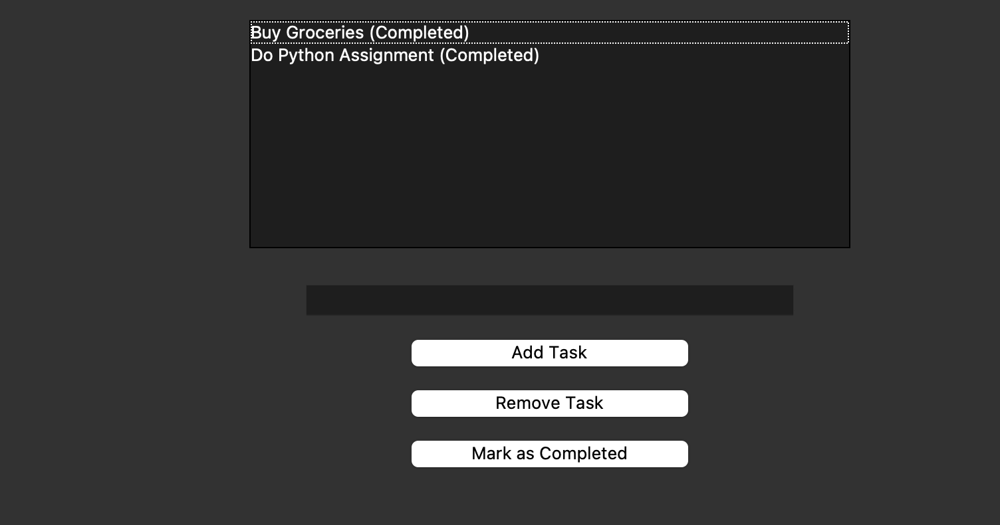

# To-Do List Application with Tkinter

## Description
This is a simple **To-Do List** application built using **Python** and **Tkinter**. It allows users to:
- Add tasks to the to-do list.
- Remove tasks from the list.
- Mark tasks as completed (by adding "(Completed)" to the task).

## Features
- Simple and intuitive GUI using Tkinter.
- Add, remove, and complete tasks.
- Uses a listbox to display tasks interactively.

## Prerequisites
To run this project, you need to have Python installed on your machine. Tkinter is included with Python by default, so no additional installation is required.

## Screenshots
Here are the screenshots of the Simple GUI Calculator:

### Screenshot 1:


### Screenshot 2:



## How to Run the Project
1. Clone the repository:
   ```bash
   git clone https://github.com/RachitTyagi17/To_Do_List.git